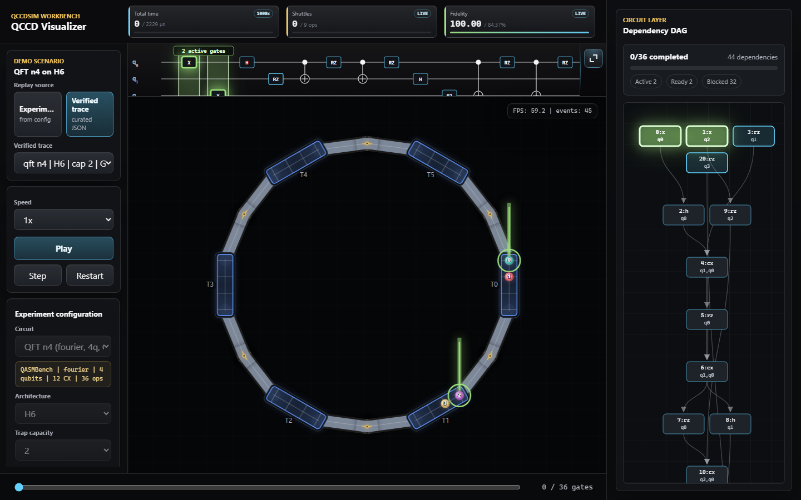
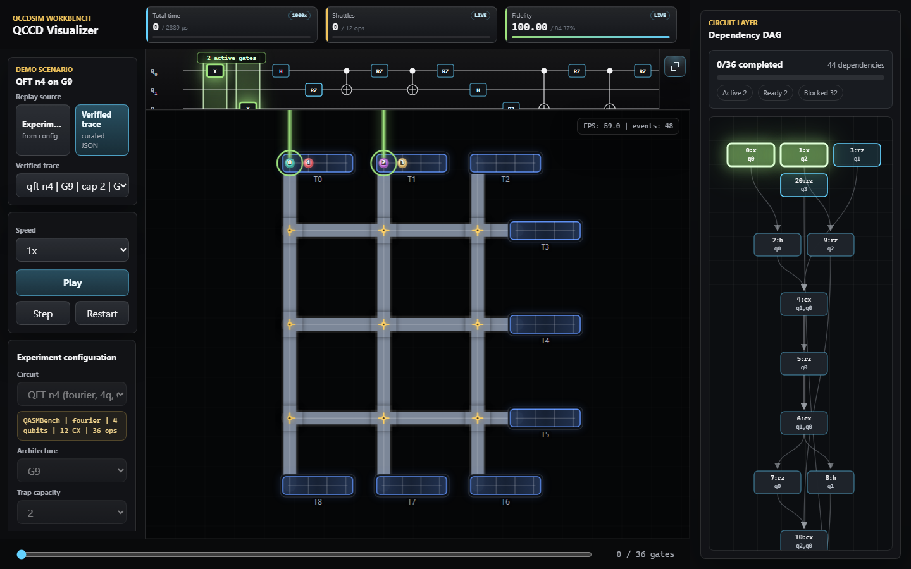

# QCCD Schedule Visualizer

This repository is the project submission of Qubit Questers for the ISIT 2026 Quantum Hackathon. The project was built as a trapped-ion QCCD scheduling visualization and verification tool, with the goal of making hardware-constrained ion movement, gate execution, and dependency progress easier to inspect during algorithm development.

QCCD Schedule Visualizer is an interactive debugger for trapped-ion QCCD schedules. It extends QCCDSim with a browser-based replay view so users can inspect ion movement, trap-chain ordering, shuttling routes, laser gate execution, dependency progress, and schedule metrics in one place.

The prototype focuses on ion-trap QCCD hardware. It does not model noise, calibration drift, or pulse-level control. Its purpose is schedule verification and explanation: it makes the process behind a QCCDSim schedule visible enough to find repeated shuttling, blocked dependencies, routing bottlenecks, and suspicious chain operations.

## Interface Preview

H6 ring-like QCCD replay:



G9 grid QCCD replay:



## At A Glance

| Item | Details |
| --- | --- |
| Event | ISIT 2026 Quantum Hackathon |
| Team | Qubit Questers |
| Scope | Trapped-ion QCCD schedule visualization and validation |
| Input | QCCDSim traces, curated JSON traces, or schedules generated from the UI |
| Output | Hardware replay, synchronized circuit strip, dependency DAG, and live metrics |
| Current status | Ion-trap prototype with QCCDSim-backed topology, replay, validation, and benchmark controls |

## Demo Path

1. Start the local server with `.\venv\Scripts\python.exe visualizer_server.py --port 63200`.
2. Open `http://127.0.0.1:63200/`.
3. Choose `Verified trace` and select the H6 QFT demo trace.
4. Press `Play` to watch ion shuttling, laser gates, circuit progress, and DAG completion advance together.

## Why This Is Not Just Animation

The replay is backed by a hardware trace contract. Before a schedule is installed, the visualizer checks topology adjacency, trap capacity, trap/channel/junction resource conflicts, chain-end split and merge legality, ion location consistency, overlapping operations, and DAG dependency timing. Invalid schedules are blocked with a concrete reason instead of being animated as if they were valid.

This makes the tool useful for scheduler and mapper debugging. The canvas is not only drawing particles; it is showing whether the recorded process is consistent with the QCCD trap-and-channel model used by QCCDSim.

## Current Use Cases

- Visual verification of scheduling algorithms. A QCCDSim trace can be replayed with hardware-valid shuttling paths, junction activity, gate timing, and dependency progress.
- Visual verification of mapping algorithms. Mapper choices change the initial ion-to-trap placement and chain order, so shuttling pressure, swap work, and gate locality can be inspected visually instead of only through aggregate metrics.
- Scheduler comparison. The current UI exposes parallel scheduling, serialized shuttling, and a global serial baseline so their behavior can be compared on the same benchmark family.
- Architecture-level experiments. QCCDSim machine layouts and trap capacities can be selected in the UI, including linear, grid, and ring-like QCCD topologies.
- Demo-ready benchmark replay. Curated traces under `visualizer/traces/` make it possible to open the page and immediately demonstrate a verified schedule without waiting for generation.

## Roadmap

- Custom QCCD architecture import and external scheduler adapters.
- Editable or importable circuit views that stay connected to mapper, scheduler, DAG, and replay logic.
- Side-by-side comparison of multiple scheduling policies on the same circuit and architecture.
- Breakthrough markers that highlight where a new mapper or scheduler improves travel distance, channel pressure, or dependency stalls.
- A broader algorithm research platform where mapping, scheduling, architecture design, validation, visualization, and metrics share one trace contract.

## What It Shows

- Trap/channel topologies derived from QCCDSim machine definitions.
- Ion chains inside each trap, with endpoint split/merge constraints.
- Architecture-aware trap orientation. Linear and grid machines keep regular horizontal trap chains, while ring-like H6 layouts rotate trap chains from their QCCDSim L/R port connections so channels enter real chain ends instead of visual midpoints.
- Shuttling along hardware-valid segment and junction paths.
- Junction highlighting when an active route passes through a junction.
- GateSwap-style split preparation: the two reported qubit labels exchange before the endpoint ion leaves the trap.
- Laser highlighting for active gate execution.
- A TikZ-style circuit strip synchronized with playback, plus an expanded circuit view.
- A full-height dependency DAG where active gates are emphasized and completed nodes dim.
- Live headline metrics for elapsed schedule time, shuttling operations, and estimated fidelity. Time and shuttle counters show per-operation deltas during playback; the time card also reports the display magnification used to make microsecond-scale hardware events visible in a demo.

## Quick Start

Install the Python dependencies:

```powershell
python -m venv venv
.\venv\Scripts\python.exe -m pip install -r requirements.txt
```

Start the local visualizer server:

```powershell
.\venv\Scripts\python.exe visualizer_server.py --port 63200
```

Open the page:

```text
http://127.0.0.1:63200/
```

The server also serves the local API used by the page:

- `GET /api/options` returns available benchmarks, architectures, capacities, mappers, orderings, and scheduler policies.
- `GET /api/trace?...` generates a fresh QCCDSim trace for the selected configuration.

## How To Use The Page

1. Choose a replay source.
   - `Experiment` generates a trace from the current controls.
   - `Verified trace` loads a curated JSON trace from `visualizer/traces/`.
2. Select a benchmark circuit, QCCD architecture, trap capacity, mapper, initial ordering, and scheduler mode.
3. Click `Generate Schedule`.
4. Press `Play` to replay the schedule, or `Step` to advance to the next event.
5. Watch the main canvas for trap-chain state, split/move/merge operations, route glow, junction glow, and laser gates.
6. Use the top circuit strip to follow the active gate; click `Expand` to inspect a larger synchronized circuit view.
7. Use the right-side DAG to see dependency progress. Active gates are brighter; completed nodes are dimmed.

The scheduler mode buttons are shortcuts for the scheduler dropdown:

- `Parallel`: allows independent cross-trap work where dependencies and resources permit it.
- `Shuttle serial`: serializes communication flow.
- `Global serial`: forces a global serial baseline.

## Data Flow

The visualizer can load schedule data in two ways.

Static traces are stored under:

```text
visualizer/traces/
visualizer/traces/manifest.json
```

Dynamic traces are generated by:

```text
visualizer_server.py
simulation.py
trace_export.py
```

For dynamic generation, the page sends the selected program, architecture, capacity, mapper, ordering, and scheduler to `/api/trace`. The backend builds a QCCDSim `SimulationConfig`, runs the QCCDSim scheduling pipeline, exports the result to a JSON trace, validates it, and returns it to the browser.

## Trace Information Used By The UI

The browser does not read raw QASM directly. It consumes the exported trace JSON. The main fields are:

- `topology.traps`: trap ids, capacities, and segment-end orientations.
- `topology.segments`: channel connections between traps and junctions.
- `topology.junctions`: junction ids and degrees.
- `topology.layout`: normalized hardware coordinates used by the renderer.
- `particles`: initial qubit or ion labels, trap locations, and initial slots.
- `events`: scheduled `gate`, `split`, `move`, and `merge` events with start/end cycles.
- `events[].metadata`: gate ids, gate names, endpoint side, swap counts, swap hops, ion hops, and reported `swap_ions`.
- `dag.nodes` and `dag.edges`: the Qiskit-derived dependency graph.
- `metrics`: finish time, operation counts, shuttling work, swap count, swap hops, ion hops, gate parallelism, and replay-estimated fidelity.
- `run`: benchmark, machine, mapper, capacity, ordering, scheduler, gate model, and swap model.

The main canvas is driven by `events`, `particles`, and `topology`. The circuit strip and DAG are driven by `dag` plus live gate-completion state. The headline metrics are derived from `metrics` and replay progress.

## Benchmarks

The benchmark catalog is based on a local QASMBench subset:

```text
programs/benchmarks/qasmbench/
programs/benchmarks/qasmbench/manifest.csv
```

The manifest records each program path, category, qubit count, operation count, CX count, and hash. The current demo set includes small and medium circuits such as Grover, QFT, adders, cat-state preparation, oracle-style circuits, QAOA-like workloads, QEC-style circuits, and larger arithmetic or ML-inspired circuits.

## Supported Controls

- Architectures: QCCDSim machine layouts exposed by `simulation.supported_machine_names()`.
- Capacities: `1, 2, 3, 4, 5, 6, 8` ions per trap region.
- Mappers: `Greedy`, `Random`, `LPFS`, `Agg`, `PO`, and deterministic `SABRE`-style placement.
- Initial ordering: `Naive` and `Fidelity`.
- Schedulers: visualizer-safe EJF variants, including parallel and serial baselines.

The page performs capacity preflight checks before generation. If a circuit cannot fit safely on the selected architecture/capacity pair, the UI shows a configuration error instead of installing an invalid replay.

## Validation

Trace validation is part of the user-facing workflow, not only a test helper. Invalid schedules are rejected before replay construction, playback controls are disabled, and the hardware stage reports the first validation failures. This is meant to support debugging of externally generated schedules as well as QCCDSim-produced traces.

The validator checks topology adjacency, trap capacity, segment and junction conflicts, split/merge chain-end legality, ion location consistency, overlapping operations on the same ion or trap, and DAG dependency timing. This means an externally produced schedule can be loaded through the same trace contract and either replayed or blocked with a concrete reason.

Run the frontend tests:

```powershell
npm --prefix visualizer test
```

Run the Python validation tests:

```powershell
.\venv\Scripts\python.exe -B -m pytest -q tests
```

The tests cover trace validation, topology consistency, replay state, DAG state, live metrics, route interpolation, junction highlighting, swap visualization, API behavior, and UI contract checks.

## Regenerating Static Demo Traces

Static traces are useful for fast demos without waiting for a new schedule to be generated:

```powershell
.\venv\Scripts\python.exe -B tools\generate_demo_traces.py
```

After regeneration, `visualizer/traces/manifest.json` controls which curated traces appear in the `Verified trace` dropdown.

## Project Structure

```text
visualizer/                 Browser UI, canvas renderer, DAG/circuit renderers, tests
visualizer_server.py         Local HTTP server and trace-generation API
trace_export.py              QCCDSim schedule-to-trace exporter
simulation.py                QCCDSim run configuration and machine/scheduler entry points
machine.py                   Trap, segment, junction, timing, and hardware parameters
mappers.py                   Placement and mapper implementations
ejf_schedule.py              EJF scheduling policy implementation
programs/benchmarks/         Local benchmark circuits and manifest
tests/                       Python validation suite
```

## Original Base

This project builds on QCCDSim by Prakash Murali and collaborators. The original QCCDSim work is described in:

```text
P. Murali et al., "Architecting Noisy Intermediate-Scale Trapped Ion Quantum Computers."
```
